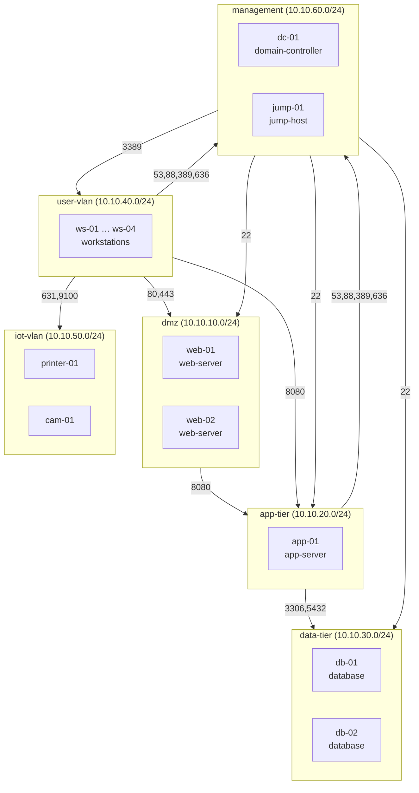

# Network Segmentation Advisor

<!-- After pushing, replace YOUR-USERNAME so the CI badge goes live -->


A zero-trust segmentation advisor: takes a network inventory (live nmap scan or replayed YAML), classifies every host by role and sensitivity, and produces a least-privilege segmentation plan - zones, an inter-zone firewall ruleset where every rule cites the NIST SP 800-207 / PCI DSS principle it implements, and a before/after attack-path simulation that shows how much lateral movement the plan cuts.

Scanning a network is table stakes; nmap already exists. The point here is the advisory engine on top: explainable, framework-grounded recommendations, plus enforceable config (iptables / pfSense) rather than prose advice.

```
ws-01 compromised (phished workstation)
before (flat):       owns 11 of 13 other hosts - including both databases and the domain controller
after  (segmented):  owns 3 (its own VLAN) - 0 critical assets reachable on a pivot port
```

## How it works

```
discovery (nmap)  ──┐
                    ├──>  Inventory (YAML)  ──>  classifier  ──>  recommender  ──>  attack_path  ──>  reporter
mock_inventory.yaml ┘     hosts/ports/svcs       role +           zones + rules     before/after      report.md, diagram,
                                                 sensitivity      + violations      simulation        iptables, pfSense
```

Discovery is the only module that touches the network. Everything downstream runs against a YAML file - meaning the entire advisory engine works offline against a mock inventory, which is also how it's tested.



*Every edge above is an explicit allow rule; everything else is default-deny. Note what's missing: no user-vlan → data-tier edge, and SMB (445) to the domain controllers is deliberately excluded from the client allow set - the classic lateral-movement channel.*

## Quickstart (no network required)

```bash
git clone https://github.com/YOUR-USERNAME/segmentation-advisor
cd segmentation-advisor
pip install -r requirements.txt

python cli.py analyze                 # console summary against the mock network
python cli.py report                  # full bundle -> output/
```

`report` writes `report.md` (inventory, violations, zones, justified ruleset, attack-path comparison), `zones.mmd` (Mermaid diagram), `iptables.rules` and `pfsense_rules.txt`. A committed sample lives in [`docs/sample-output/`](docs/sample-output/report.md).

### Scanning a real (authorised) network

```bash
pip install python-nmap && brew install nmap   # or apt install nmap
python cli.py discover --target 192.168.1.0/24 --out inventory.yaml
python cli.py report --inventory inventory.yaml
```

Scans save to YAML, so you can replay the same capture through the advisory engine as many times as you want without re-scanning. **Only scan networks you own or are explicitly authorised to test.**

### End-to-end test lab (Docker)

`docker-compose.yml` stands up a fake flat network (nginx ×2, MySQL, PostgreSQL, Redis, a Python app) on one bridge subnet. Docker on macOS doesn't route host→container, so a `scanner` container runs discovery from inside the topology - instructions are at the top of the compose file.

## Inside the engine

The **classifier** (`advisor/classifier.py`) assigns each host a role and sensitivity tier from signatures in [`data/role_signatures.yaml`](data/role_signatures.yaml): port/service heuristics with priorities and negative evidence. SMB + RDP present → workstation, not file server. Adding a new device type means editing the YAML; a unit test covers this by loading a custom SCADA signature.

The **recommender** (`advisor/recommender.py`) groups hosts into trust zones - DMZ, app-tier, data-tier, user-vlan, iot-vlan, management, and quarantine for anything unclassified - then derives the minimal allow set from roles actually observed. Ports are never opened speculatively. It also flags violations in the current layout: flat network, databases one hop from workstations, exposed management interfaces, cleartext Telnet, IoT devices mixed with users. Each violation maps to NIST SP 800-207 or PCI DSS.

The **attack-path simulator** (`advisor/attack_path.py`) models reachability as a graph and runs breadth-first lateral-movement from a chosen foothold, twice: against the flat network and against the proposed policy. Deliberately conservative - reaching any port counts as exposure; pivoting requires a remote-admin service (SSH/RDP/SMB/RPC/Telnet/WinRM). The report keeps honest caveats: intra-zone movement isn't modelled, and services exposed by design are still attack surface.

The **exporters** (`advisor/exporters/`) emit the ruleset as iptables FORWARD-chain commands and pfSense per-interface pass rules, each line annotated with its framework justification.

## Why it's built this way

Rules, not ML. A recommendation you can't explain is one you can't defend - to an interviewer or a change-advisory board. Every output traces to a named signature or a cited framework principle.

Discovery and reasoning are completely separated: the advisory logic never touches the network. That makes it fully unit-testable (30 tests, CI on 3.11/3.12) and means it runs in air-gapped environments against replayed scans.

The generated policy only opens a port if a destination host in that zone actually exposes it - least privilege applied to the ruleset itself, not just the design philosophy.

The attack-path simulation states its assumptions upfront and reports residual risk rather than overclaiming what segmentation solves.

## Framework mapping

| Output | Principle |
|---|---|
| Default-deny inter-zone baseline | NIST SP 800-207 §3.1.2 (micro-segmentation); PCI DSS v4.0 Req 1.2/1.3 |
| Per-rule justifications | NIST SP 800-207 §2.1 Tenet 3 (least-privilege, per-session access) |
| Quarantine zone for unknown assets | NIST SP 800-207 §2.1 Tenet 4 (no implicit trust from location) |
| Data-tier isolation from user VLAN | PCI DSS v4.0 scoping/segmentation guidance |
| Cleartext-protocol flags | PCI DSS v4.0 Req 2.2.5 (insecure services) |

## Tests

```bash
pip install -r requirements-dev.txt
pytest
```

Classifier, recommender, attack-path and model suites all run against the mock inventory - no network, no Docker, sub-second.

## Roadmap

- Host-level micro-segmentation within zones (NIST SP 800-207 §3.1.1)
- UDP service handling and OS-fingerprint-aware classification
- pfSense `config.xml` generation for direct import
- A second mock topology (already-segmented network) to test violation detection in non-flat layouts

## Portfolio note

> Built a zero-trust network segmentation advisor in Python: classifies discovered assets, generates a least-privilege inter-zone firewall policy with every rule mapped to NIST SP 800-207 / PCI DSS, and validates it with before/after attack-path simulation (lateral movement cut from 11 hosts - including all critical assets - to 3, with zero critical assets reachable).

## License

MIT - see [LICENSE](LICENSE).
