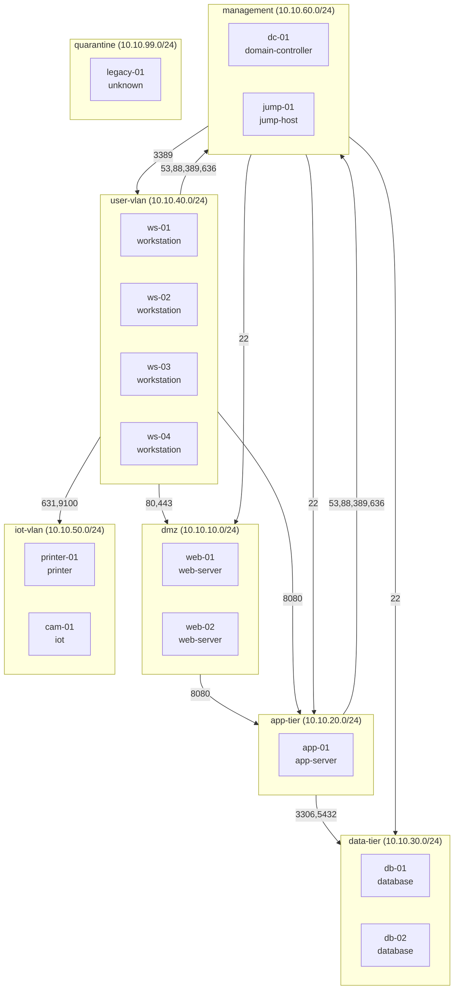

# Network Segmentation Advisory Report

*Generated: 2026-06-12 21:02 UTC · Source: `mock` · 14 hosts*

## 1. Executive summary

The current network is assessed against zero-trust principles (NIST SP 800-207) and PCI DSS segmentation guidance. **6 violations** were found (4 high severity). The proposed design groups assets into **7 zones** with **20 explicit allow rules** over a default-deny baseline. Simulating a compromised workstation, lateral movement drops from **11 hosts owned** (including 3 critical assets) to **3** (0 critical).

## 2. Asset inventory and classification

| Host | IP | Role | Sensitivity | Key services |
|---|---|---|---|---|
| dc-01 | 192.168.1.5 | domain-controller | critical | 53/tcp domain, 88/tcp kerberos-sec, 135/tcp msrpc, 389/tcp ldap, 445/tcp microsoft-ds, 636/tcp ldapssl |
| web-01 | 192.168.1.10 | web-server | medium | 22/tcp ssh, 80/tcp http, 443/tcp https |
| web-02 | 192.168.1.11 | web-server | medium | 22/tcp ssh, 80/tcp http, 443/tcp https |
| app-01 | 192.168.1.20 | app-server | medium | 22/tcp ssh, 8080/tcp http-alt |
| db-01 | 192.168.1.30 | database | critical | 22/tcp ssh, 3306/tcp mysql |
| db-02 | 192.168.1.31 | database | critical | 22/tcp ssh, 5432/tcp postgresql |
| jump-01 | 192.168.1.50 | jump-host | high | 22/tcp ssh |
| ws-01 | 192.168.1.101 | workstation | standard | 135/tcp msrpc, 445/tcp microsoft-ds, 3389/tcp ms-wbt-server |
| ws-02 | 192.168.1.102 | workstation | standard | 135/tcp msrpc, 445/tcp microsoft-ds, 3389/tcp ms-wbt-server |
| ws-03 | 192.168.1.103 | workstation | standard | 135/tcp msrpc, 445/tcp microsoft-ds, 3389/tcp ms-wbt-server |
| ws-04 | 192.168.1.104 | workstation | standard | 135/tcp msrpc, 445/tcp microsoft-ds, 3389/tcp ms-wbt-server |
| printer-01 | 192.168.1.120 | printer | untrusted | 80/tcp http, 631/tcp ipp, 9100/tcp jetdirect |
| cam-01 | 192.168.1.121 | iot | untrusted | 23/tcp telnet, 80/tcp http, 554/tcp rtsp |
| legacy-01 | 192.168.1.200 | unknown | standard | 102/tcp iso-tsap |

## 3. Violations in the current layout

### [HIGH] Flat network — no segmentation

All 14 hosts share 192.168.1.0/24. Any compromised host can attempt connections to every service on the network; trust is implied by network location.

*Affected:* dc-01, web-01, web-02, app-01, db-01, db-02, jump-01, ws-01, ws-02, ws-03, ws-04, printer-01, cam-01, legacy-01

*Framework:* NIST SP 800-207 §2.1 Tenet 4 — no implicit trust from network location; NIST SP 800-207 §3.1.2 — network micro-segmentation

### [HIGH] Critical data stores directly reachable from user workstations

Database/file-store ports are reachable from the user segment with no policy enforcement point in between. A single phished workstation is one hop from the data.

*Affected:* db-01, db-02

*Framework:* NIST SP 800-207 §2.1 Tenet 3 — access granted per-session with least privilege; PCI DSS v4.0 scoping guidance — segmentation isolates the cardholder/sensitive data environment and reduces audit scope

### [HIGH] Management interfaces exposed to the entire network

SSH/RDP/Telnet/VNC on servers is reachable from every host. Administrative access should originate only from a management zone or jump host.

*Affected:* web-01, web-02, app-01, db-01, db-02, jump-01, cam-01

*Framework:* NIST SP 800-207 §2.1 Tenet 3 — access granted per-session with least privilege; PCI DSS v4.0 Req 1.2/1.3 — restrict traffic to that which is necessary

### [HIGH] Cleartext management protocols in use

cam-01 exposes Telnet (23/tcp). Credentials cross the wire unencrypted.

*Affected:* cam-01

*Framework:* PCI DSS v4.0 Req 2.2.5 — insecure services/protocols

### [MEDIUM] Unmanaged IoT devices share a segment with workstations

Printers/cameras are rarely patched and frequently expose weak services; co-locating them with user endpoints gives an attacker an easy persistence point.

*Affected:* printer-01, cam-01

*Framework:* NIST SP 800-207 §3.1.2 — network micro-segmentation

### [LOW] Unclassified assets on the network

These hosts match no known role signature. Zero trust grants no implicit access: quarantine until identified.

*Affected:* legacy-01

*Framework:* NIST SP 800-207 §2.1 Tenet 4 — no implicit trust from network location

## 4. Proposed zones

| Zone | Trust tier | Proposed subnet | Hosts |
|---|---|---|---|
| dmz | exposed | 10.10.10.0/24 | web-01, web-02 |
| app-tier | internal | 10.10.20.0/24 | app-01 |
| data-tier | restricted | 10.10.30.0/24 | db-01, db-02 |
| user-vlan | internal | 10.10.40.0/24 | ws-01, ws-02, ws-03, ws-04 |
| iot-vlan | untrusted | 10.10.50.0/24 | printer-01, cam-01 |
| management | restricted | 10.10.60.0/24 | dc-01, jump-01 |
| quarantine | untrusted | 10.10.99.0/24 | legacy-01 |

## 5. Inter-zone ruleset (least privilege)

| # | Source | Destination | Port | Action | Justification |
|---|---|---|---|---|---|
| 1 | user-vlan | dmz | 80/tcp | **allow** | Users may reach published web services only; NIST SP 800-207 §2.1 Tenet 3 — access granted per-session with least privilege |
| 2 | user-vlan | dmz | 443/tcp | **allow** | Users may reach published web services only; NIST SP 800-207 §2.1 Tenet 3 — access granted per-session with least privilege |
| 3 | dmz | app-tier | 8080/tcp | **allow** | Web tier may call internal app APIs on observed ports only; PCI DSS v4.0 Req 1.2/1.3 — restrict traffic to that which is necessary |
| 4 | user-vlan | app-tier | 8080/tcp | **allow** | Users may reach internal applications on observed ports; NIST SP 800-207 §2.1 Tenet 3 — access granted per-session with least privilege |
| 5 | app-tier | data-tier | 3306/tcp | **allow** | Only the application tier may query databases, on observed DB ports; PCI DSS v4.0 scoping guidance — segmentation isolates the cardholder/sensitive data environment and reduces audit scope |
| 6 | app-tier | data-tier | 5432/tcp | **allow** | Only the application tier may query databases, on observed DB ports; PCI DSS v4.0 scoping guidance — segmentation isolates the cardholder/sensitive data environment and reduces audit scope |
| 7 | user-vlan | management | 53/tcp | **allow** | Domain clients need DNS/Kerberos/LDAP from domain controllers; SMB (445) deliberately excluded — NIST SP 800-207 §2.1 Tenet 4 — no implicit trust from network location |
| 8 | user-vlan | management | 88/tcp | **allow** | Domain clients need DNS/Kerberos/LDAP from domain controllers; SMB (445) deliberately excluded — NIST SP 800-207 §2.1 Tenet 4 — no implicit trust from network location |
| 9 | user-vlan | management | 389/tcp | **allow** | Domain clients need DNS/Kerberos/LDAP from domain controllers; SMB (445) deliberately excluded — NIST SP 800-207 §2.1 Tenet 4 — no implicit trust from network location |
| 10 | user-vlan | management | 636/tcp | **allow** | Domain clients need DNS/Kerberos/LDAP from domain controllers; SMB (445) deliberately excluded — NIST SP 800-207 §2.1 Tenet 4 — no implicit trust from network location |
| 11 | app-tier | management | 53/tcp | **allow** | Domain clients need DNS/Kerberos/LDAP from domain controllers; SMB (445) deliberately excluded — NIST SP 800-207 §2.1 Tenet 4 — no implicit trust from network location |
| 12 | app-tier | management | 88/tcp | **allow** | Domain clients need DNS/Kerberos/LDAP from domain controllers; SMB (445) deliberately excluded — NIST SP 800-207 §2.1 Tenet 4 — no implicit trust from network location |
| 13 | app-tier | management | 389/tcp | **allow** | Domain clients need DNS/Kerberos/LDAP from domain controllers; SMB (445) deliberately excluded — NIST SP 800-207 §2.1 Tenet 4 — no implicit trust from network location |
| 14 | app-tier | management | 636/tcp | **allow** | Domain clients need DNS/Kerberos/LDAP from domain controllers; SMB (445) deliberately excluded — NIST SP 800-207 §2.1 Tenet 4 — no implicit trust from network location |
| 15 | user-vlan | iot-vlan | 631/tcp | **allow** | Workstations may print, nothing more; IoT stays isolated — NIST SP 800-207 §3.1.2 — network micro-segmentation |
| 16 | user-vlan | iot-vlan | 9100/tcp | **allow** | Workstations may print, nothing more; IoT stays isolated — NIST SP 800-207 §3.1.2 — network micro-segmentation |
| 17 | management | dmz | 22/tcp | **allow** | Administrative access (SSH/RDP) originates only from the management zone via the jump host; NIST SP 800-207 §2.1 Tenet 3 — access granted per-session with least privilege |
| 18 | management | app-tier | 22/tcp | **allow** | Administrative access (SSH/RDP) originates only from the management zone via the jump host; NIST SP 800-207 §2.1 Tenet 3 — access granted per-session with least privilege |
| 19 | management | data-tier | 22/tcp | **allow** | Administrative access (SSH/RDP) originates only from the management zone via the jump host; NIST SP 800-207 §2.1 Tenet 3 — access granted per-session with least privilege |
| 20 | management | user-vlan | 3389/tcp | **allow** | Administrative access (SSH/RDP) originates only from the management zone via the jump host; NIST SP 800-207 §2.1 Tenet 3 — access granted per-session with least privilege |
| 21 | * | * | any/any | **deny** | Zero-trust default-deny between zones; NIST SP 800-207 §3.1.2 — network micro-segmentation; PCI DSS v4.0 Req 1.2/1.3 — restrict traffic to that which is necessary |

## 6. Attack-path analysis — before vs after

Simulated foothold: **ws-01** (assumed phished workstation). "Owned" means the attacker can pivot through the host via a remote-admin service (SSH/RDP/SMB/RPC/Telnet/WinRM); "exposed" means at least one service is reachable.

| Metric | Before (flat) | After (segmented) |
|---|---|---|
| Hosts owned (beyond foothold) | 11 | 3 |
| Hosts with services exposed | 14 | 9 |
| **Critical assets owned** | **3** (db-01, db-02, dc-01) | **0** (—) |

### Example attack paths cut by segmentation

- `ws-01 → dc-01` — **blocked** after segmentation (no allow rule carries pivot traffic across zones).
- `ws-01 → web-01` — **blocked** after segmentation (no allow rule carries pivot traffic across zones).
- `ws-01 → web-02` — **blocked** after segmentation (no allow rule carries pivot traffic across zones).
- `ws-01 → app-01` — **blocked** after segmentation (no allow rule carries pivot traffic across zones).
- `ws-01 → db-01` — **blocked** after segmentation (no allow rule carries pivot traffic across zones).
- `ws-01 → db-02` — **blocked** after segmentation (no allow rule carries pivot traffic across zones).

### Residual risk (honest caveats)

- Intra-zone traffic is unrestricted: a compromised workstation can still attack its neighbours. Host-level micro-segmentation is the next maturity step (NIST SP 800-207 §3.1.1).
- Services that remain exposed by design (e.g. web ports, Kerberos/LDAP to the DCs) are still application-layer attack surface; segmentation reduces, not eliminates, risk.

## 7. Enforcement artifacts

- `iptables.rules` — Linux zone-router FORWARD-chain policy
- `pfsense_rules.txt` — pfSense per-interface pass rules

## Appendix: methodology

Classification is signature-based (`data/role_signatures.yaml`): data-driven port/service heuristics, highest priority wins. Zoning maps roles to trust tiers. The ruleset starts from default-deny and adds only allows implied by roles actually observed — ports are never opened speculatively. The attack-path model treats any reachable service as exposure and remote-admin services as pivot channels. Every output cites the framework principle it implements.
